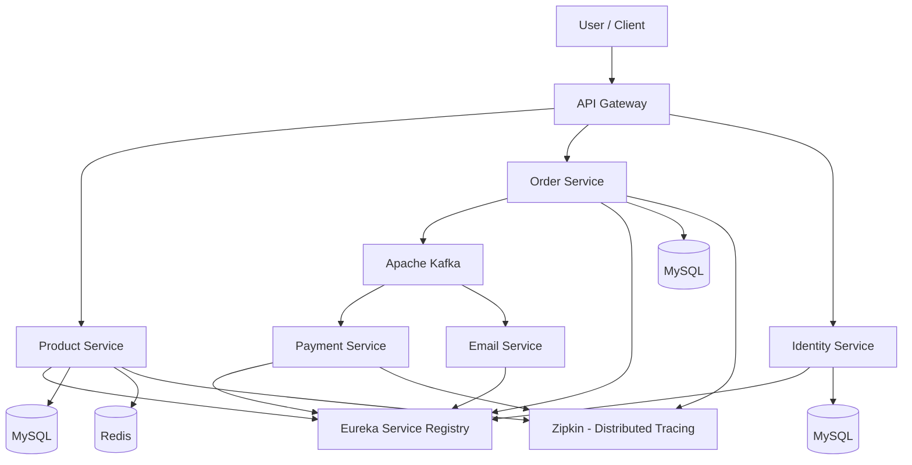

# Distributed Cloud Computing - E-Commerce Microservices

## 1. Application Name

E-Commerce Microservices Application

## 2. Application Description

This project is an e-commerce backend application developed using a
microservices architecture. The application separates different business
functionalities such as product management, order processing, payment,
identity management and email notification into independent services.

The services communicate using REST/HTTP and asynchronous messaging.
Docker and Docker Compose are used to containerize and manage the
different application components.

## 3. Architecture Used

The application uses Microservices Architecture.

The major components are:

- API Gateway
- Service Registry (Eureka)
- Product Service
- Order Service
- Payment Service
- Identity Service
- Email Service

Each service performs a specific business function and can operate
independently.

## 4. Communication Mechanism

The application uses multiple communication mechanisms:

### REST/HTTP

REST APIs are used for communication between clients and services.

### OpenFeign

OpenFeign is used to simplify HTTP communication between microservices.

### Apache Kafka

Kafka is used for asynchronous and event-driven communication between
services.

## 5. Data Storage

### MySQL

MySQL is used as the primary relational SQL database.

Different services have separate databases to provide data isolation.

### Redis

Redis is used for temporary data storage and caching.

## 6. Computing Type

The project uses Distributed Computing and Containerized Computing.

The application is divided into multiple independent microservices that
can run as separate processes or containers.

Docker and Docker Compose are used to deploy and manage these components.

## 7. Technology Stack

### Programming Language

- Java

### Backend Framework

- Spring Boot
- Spring Cloud

### Microservices Technologies

- Spring Cloud Gateway
- Eureka Service Discovery
- OpenFeign

### Messaging

- Apache Kafka

### Databases

- MySQL
- Redis

### Containerization

- Docker
- Docker Compose

### Monitoring and Tracing

- Zipkin

### Version Control

- Git
- GitHub

## 8. Architecture Flow

The following diagram shows the major components and communication flow of the application:

## 9. Containerization

Docker is used to containerize the application components.

Docker Compose manages multiple containers, their dependencies,
networking and configuration.

## 10. Distributed Computing Concepts Demonstrated

- Microservices architecture
- Service discovery
- API Gateway
- Inter-service communication
- Asynchronous messaging
- Event-driven architecture
- Database isolation
- Containerization
- Distributed tracing
- Service scalability

## 11. Academic Purpose

This repository is being used for academic study as part of the
Distributed Cloud Computing course.

The project is based on an existing open-source project and is analyzed
to understand distributed systems, microservices, communication,
storage and containerization concepts.

## 12. Original Project / Attribution

Original repository:
https://github.com/haphong463/springboot-kafka-microservices

The original project is licensed under the MIT License.
